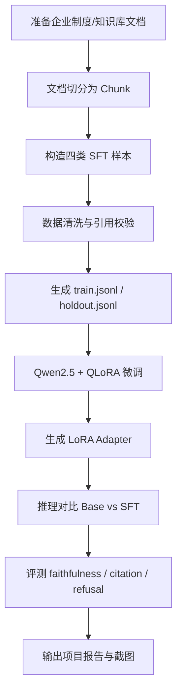

# 知识库忠实回答与拒答能力微调项目计划书

## 1. 项目名称

**知识库忠实回答与拒答能力微调项目**

建议仓库名：

```text
kb-sft-faithful-refusal
```

建议提交文件夹名：

```text
X组_鲍勃_知识库微调_企业制度
```

---

## 2. 项目背景

在企业知识库问答场景中，RAG 系统可以通过检索召回相关文档片段，但生成模型并不一定会严格依据检索内容回答。实际应用中常见问题包括：

1. 检索内容中没有的信息，模型仍然编造回答；
2. 检索内容不足或无关时，模型强行作答；
3. 答案内容和引用来源不一致；
4. 多个片段之间存在冲突时，模型没有识别冲突并提示人工确认。

因此，本项目计划通过 SFT / QLoRA 微调，让模型在企业知识库问答中具备更强的：

```text
忠实回答能力 + 证据引用能力 + 资料不足拒答能力
```

---

## 3. 项目目标

本项目用两天时间完成一个可演示、可提交、可写进简历的微调专项闭环。

### 3.1 核心目标

训练一个面向知识库问答的微调模型，使其能够：

1. **只依据检索片段回答问题**；
2. **回答中标注引用来源**，例如 `[C1]`、`[C2]`；
3. **资料不足、无关或冲突时主动拒答**；
4. 通过评测集展示微调前后的效果对比。

### 3.2 两天版范围控制

两天内不追求完整工业级训练，而是优先完成闭环：

```text
数据构造 → 数据清洗 → QLoRA 训练脚本 → 小规模训练/推理 → Before/After 评测 → 项目报告
```

模型优先使用：

```text
Qwen2.5-3B-Instruct + QLoRA
```

如果显存和时间允许，再切换到：

```text
Qwen2.5-7B-Instruct + QLoRA
```

---

## 4. 项目范围

### 4.1 本次做什么

本项目聚焦两个训练目标：

| 训练目标     | 说明                          |
| -------- | --------------------------- |
| 带引用的忠实回答 | 有资料时严格依据资料回答，并在句末标注引用       |
| 资料不足时拒答  | 资料无关、缺失或冲突时，不强行回答，并指出缺少什么信息 |

### 4.2 本次不做什么

两天版暂不做以下内容：

| 暂不做              | 原因                     |
| ---------------- | ---------------------- |
| 全量工业数据集          | 两天时间不足，先做小规模高质量样本      |
| DPO / PPO / RLHF | 当前目标是 SFT 闭环，不扩大范围     |
| 完整线上部署           | 先完成训练、推理和评测，部署作为后续扩展   |
| 大规模 benchmark    | 先做自建 holdout，后续再补公开评测集 |

---

## 5. 技术方案

### 5.1 技术栈

| 模块   | 技术选择                                      |
| ---- | ----------------------------------------- |
| 基座模型 | Qwen2.5-3B-Instruct / Qwen2.5-7B-Instruct |
| 微调方法 | QLoRA                                     |
| 训练框架 | transformers + TRL + PEFT + bitsandbytes  |
| 数据格式 | JSONL                                     |
| 评测方式 | 规则评测 + LLM-as-Judge                       |
| 输出形式 | README + 训练脚本 + 评测脚本 + 测试截图               |

### 5.2 数据结构

每条训练样本包含：

```json
{
  "id": "kb-000001",
  "type": "answerable",
  "question": "国内出差住宿费报销上限是多少？",
  "contexts": [
    {
      "cid": "C1",
      "source": "《差旅报销制度》v3 第3.1条",
      "text": "国内出差住宿费：一线城市每晚不超过600元，其他城市不超过400元，凭发票实报实销。"
    }
  ],
  "answer": "国内出差住宿费按城市分级：一线城市每晚上限600元，其他城市每晚上限400元，均需凭发票实报实销 [C1]。"
}
```

### 5.3 样本类型

| 类型           | 作用      | 占比建议 |
| ------------ | ------- | ---: |
| answerable   | 单片段可回答  |  35% |
| multi_chunk  | 多片段整合回答 |  25% |
| unanswerable | 资料不足拒答  |  25% |
| conflicting  | 资料冲突拒答  |  15% |

两天版目标数据规模：

```text
train.jsonl：300–800 条
holdout.jsonl：40–100 条
```

如果时间充足，再扩展到：

```text
train.jsonl：1500 条
holdout.jsonl：150 条
```

---

## 6. 系统流程



---

## 7. 两天执行计划

## Day 1：数据与训练闭环

### 上午：确定项目骨架与数据 schema

**目标：** 建好仓库结构，确定数据格式和样本类型。

任务：

1. 创建项目目录；
2. 编写 `README.md` 初版；
3. 编写 `docs/architecture.md`；
4. 确定四类样本格式；
5. 准备 3–5 篇企业制度类文档或仿真文档。

交付物：

```text
README.md
docs/architecture.md
data/raw_docs/
data/sample.jsonl
```

---

### 下午：构造训练数据与清洗脚本

**目标：** 生成第一版训练集和评测集。

任务：

1. 编写 `scripts/build_dataset.py`；
2. 构造四类样本；
3. 做引用编号校验；
4. 做重复样本清理；
5. 做 train / holdout 切分；
6. 生成数据报告。

交付物：

```text
data/train.jsonl
data/holdout.jsonl
eval/data_report.md
scripts/build_dataset.py
```

数据质量检查：

```text
□ answer 中的 [C编号] 必须存在于 contexts.cid
□ unanswerable 样本不能编造具体数字
□ conflicting 样本必须明确指出冲突来源
□ train / holdout 不能重复
□ 每类样本都要覆盖
```

---

### 晚上：训练脚本跑通

**目标：** 跑通 QLoRA 训练流程，优先小模型、小样本闭环。

任务：

1. 编写 `src/train_sft.py`；
2. 固定依赖版本；
3. 加载 Qwen2.5-3B-Instruct；
4. 使用 QLoRA 训练；
5. 保存 LoRA Adapter；
6. 截图训练日志。

交付物：

```text
src/train_sft.py
pyproject.toml
outputs/kb-sft/
screenshots/01_training_log.png
```

---

## Day 2：推理、评测、报告与提交材料

### 上午：推理对比

**目标：** 对 Base 模型和 SFT 模型做同题对比。

任务：

1. 编写 `scripts/infer_compare.py`；
2. 准备 10–20 条典型测试问题；
3. 分别调用 Base 和 SFT 模型；
4. 保存对比结果；
5. 截图典型案例。

交付物：

```text
scripts/infer_compare.py
outputs/before_after.md
screenshots/02_before_after_case.png
```

典型对比案例包括：

| 类型   | 问题              |
| ---- | --------------- |
| 可回答  | 根据资料回答具体制度问题    |
| 多片段  | 需要合并多个片段回答      |
| 无资料  | 检索内容无关，应拒答      |
| 冲突资料 | 两个片段口径不一致，应提示冲突 |

---

### 下午：评测脚本与指标表

**目标：** 输出可量化的 Before/After 表。

任务：

1. 编写 `eval/run_eval.py`；
2. 计算引用准确率；
3. 计算拒答召回；
4. 计算误拒率；
5. 使用 LLM-as-Judge 或人工抽检评估 faithfulness；
6. 生成 `docs/evaluation.md`。

交付物：

```text
eval/run_eval.py
docs/evaluation.md
screenshots/03_eval_result.png
```

评测指标：

| 指标                  | 含义         | 目标 |
| ------------------- | ---------- | -- |
| faithfulness        | 答案是否全部有依据  | 提升 |
| citation accuracy   | 引用编号是否正确   | 提升 |
| answer completeness | 是否遗漏关键条件   | 提升 |
| refusal recall      | 应拒答问题是否拒答  | 提升 |
| false refusal       | 可回答问题是否被误拒 | 降低 |

---

### 晚上：整理提交材料

**目标：** 形成可交付文件夹。

任务：

1. 完善 `README.md`；
2. 完善 `docs/troubleshooting.md`；
3. 整理截图；
4. 删除无关依赖、缓存、大模型权重；
5. 检查提交文件夹结构；
6. 准备面试表达和简历 bullet。

最终交付目录：

```text
X组_鲍勃_知识库微调_企业制度/
├── README.md
├── pyproject.toml
├── data/
│   ├── train.jsonl
│   └── holdout.jsonl
├── src/
│   └── train_sft.py
├── scripts/
│   ├── build_dataset.py
│   ├── infer_compare.py
│   └── merge.py
├── eval/
│   ├── run_eval.py
│   └── data_report.md
├── docs/
│   ├── architecture.md
│   ├── evaluation.md
│   └── troubleshooting.md
└── screenshots/
    ├── 01_training_log.png
    ├── 02_before_after_case.png
    └── 03_eval_result.png
```

---

## 8. 验收标准

### 8.1 基础验收

```text
□ 有完整 README
□ 有项目架构说明
□ 有数据构造脚本
□ 有训练脚本
□ 有评测脚本
□ 有 train / holdout 数据
□ 有训练日志截图
□ 有微调前后对比截图
□ 有评测结果截图
```

### 8.2 工程验收

```text
□ 数据 schema 清晰
□ 四类样本都有覆盖
□ 引用编号不会越界
□ prompt 部分不参与 loss
□ assistant 回答部分参与 loss
□ LoRA adapter 可保存
□ Base 和 SFT 能同题对比
□ 评测指标可复现
```

### 8.3 面试验收

项目完成后，需要能讲清楚：

```text
1. 为什么 RAG 还需要 SFT？
2. 为什么只训练忠实回答和拒答，不训练全部能力？
3. 数据是怎么构造和清洗的？
4. labels mask 为什么要把 prompt 置为 -100？
5. 怎么证明微调有效？
6. 为什么拒答召回和误拒率必须一起看？
7. 如果模型什么都拒答，怎么排查？
8. 如果模型引用 [C3] 但资料里没有 C3，怎么修？
```

---

## 9. 风险与应对

| 风险           | 表现                        | 应对                           |
| ------------ | ------------------------- | ---------------------------- |
| 显存不够         | 7B 无法训练                   | 先用 3B 跑通闭环                   |
| 时间不够         | 无法构造 1500 条数据             | 两天版先做 300–800 条              |
| 模型过度拒答       | 可回答问题也拒答                  | 降低拒答样本比例，关注 false refusal    |
| 引用幻觉         | 编造不存在的 `[C3]`             | 数据构造阶段做引用校验                  |
| loss 降了但效果不好 | 评测指标无提升                   | 以 Before/After 指标为准，不只看 loss |
| 依赖版本冲突       | TRL / transformers API 报错 | 固定版本，保留 pyproject.toml       |

---

## 10. 项目最终成果

两天结束后，项目应至少产出：

1. 一个可提交的项目文件夹；
2. 一套四类 SFT 数据；
3. 一个 QLoRA 训练脚本；
4. 一个微调前后推理对比结果；
5. 一个评测报告；
6. 三张以上测试截图；
7. 一段可用于简历和面试的项目表达。

---

## 11. 简历表达

```text
完成知识库问答场景下的领域 SFT 微调项目，基于用户问题、检索片段、标准答案和不可回答样例构造四类训练数据，使用 Qwen2.5 + QLoRA 优化模型的检索忠实回答、证据引用和资料不足拒答能力；通过 Base 与 SFT 模型的 Before/After 对比，评估 faithfulness、citation accuracy、refusal recall 和 false refusal 等指标，验证微调对 RAG 生成可靠性的提升。
```

---

## 12. 两天完成标准

本项目两天版的完成标准不是“训练出最强模型”，而是完成一个工程闭环：

```text
能构造数据
能训练模型
能推理对比
能评测结果
能截图提交
能面试讲清楚
```

只要以上六点完成，这个项目就可以作为微调专项的第一版成果进入项目库。
