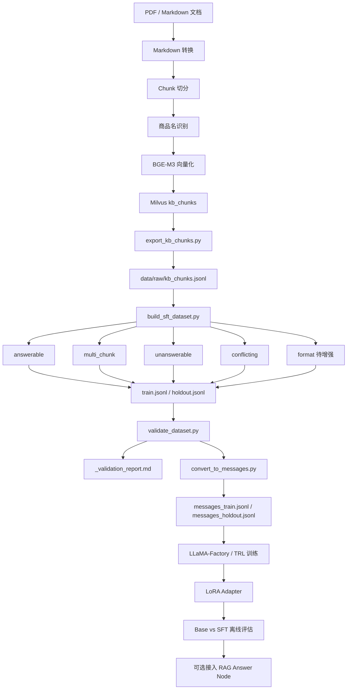

# 掌柜智库 fine_tuning 微调专项企业工程方案

## 1. 项目定位

`fine_tuning` 是掌柜智库项目中的离线微调专项模块，定位是：

```text
基于现有知识库 chunk 构造 SFT 数据，
训练模型在 RAG 场景下更可靠地使用检索上下文，
提升忠实回答、引用标注、资料不足拒答和格式适配能力。
```

它不是线上导入链路的一部分，也不是实时查询链路的一部分，而是位于：

```text
Milvus Chunk 入库之后
RAG Answer Node 接入之前
```

一句话总结：

```text
Milvus 存证据，RAG 找证据，fine_tuning 训练模型更可靠地使用证据。
```

## 2. 建设背景

当前掌柜智库已经具备知识库导入能力，可以将 PDF / Markdown 文档解析、切分、向量化并写入 Milvus。

但是，RAG 系统只解决“能不能找到相关资料”的问题，并不保证大模型在生成阶段一定能正确使用资料。企业知识库问答中常见问题包括：

```text
1. 检索资料中没有的事实，模型仍然编造回答；
2. 检索资料不足时，模型强行作答；
3. 答案没有引用来源，无法追溯；
4. 答案引用编号和实际上下文不一致；
5. 多个资料片段冲突时，模型没有提示冲突；
6. 操作步骤、故障排查、参数说明等格式不稳定。
```

因此，本项目新增 `fine_tuning` 离线模块，用真实知识库 chunk 构造 SFT 数据，让模型学习在 RAG 场景下的稳定行为。

## 3. 工程目标

### 3.1 阶段一目标

阶段一只负责本地数据闭环，不进入训练。

目标链路：

```text
Milvus chunk
  -> kb_chunks.jsonl
  -> SFT 样本
  -> 数据校验报告
  -> messages 训练格式
  -> 五类能力映射元数据
```

阶段一完成后，应证明：

```text
1. 可以从真实 Milvus 知识库导出 chunk；
2. 可以基于 chunk 构造 SFT 样本；
3. 可以校验引用、拒答、重复、长度、类型分布；
4. 可以转换为 LLaMA-Factory / TRL 可读取的 messages 格式；
5. 可以明确每条样本对应的训练能力。
```

### 3.2 最终训练目标

| 能力 | 含义 |
|---|---|
| faithful | 忠实回答，只依据检索上下文作答 |
| multi_hop | 多片段整合，综合多个 chunk 回答 |
| cite | 引用标注，答案中保留 `[C1]`、`[C2]` |
| refuse | 资料不足、无关或冲突时拒答 |
| format | 按业务场景输出稳定格式，如步骤型、表格型、故障排查型 |

## 4. 阶段一不做范围

```text
1. 不训练模型；
2. 不接 vLLM；
3. 不改现有导入接口；
4. 不改现有查询链路；
5. 不提交真实 jsonl 数据；
6. 不提交 config.yaml；
7. 不提交模型权重、LoRA adapter 或 checkpoint。
```

阶段一目标是先验证数据工程闭环，不追求训练效果。训练前必须先保证数据可导出、可构造、可校验、可转换。

## 5. 系统架构

### 5.1 总体架构

```text
knowledge 主链路
  PDF / MD
    -> Markdown
    -> Chunk
    -> 商品名识别
    -> BGE-M3 Embedding
    -> Milvus kb_chunks

fine_tuning 离线链路
  Milvus kb_chunks
    -> export_kb_chunks.py
    -> kb_chunks.jsonl
    -> build_sft_dataset.py
    -> train / holdout
    -> validate_dataset.py
    -> validation_report
    -> convert_to_messages.py
    -> messages_train / messages_holdout
    -> 后续 LLaMA-Factory / TRL 训练

后续评估链路
  holdout
    -> Base 模型推理
    -> SFT 模型推理
    -> 指标评估
    -> before_after.md / evaluation.md

后续接入链路
  RAG Answer Node
    -> base model / sft adapter 可切换
```

### 5.2 Mermaid 架构图



## 6. 目录结构设计

```text
fine_tuning/
├── README.md
├── configs/
│   ├── config.example.yaml
│   └── config.yaml              # 本地文件，不提交 Git
├── data/
│   ├── raw/
│   │   ├── kb_chunks.jsonl       # 导出产物，不提交 Git
│   │   └── _export_stats.json
│   └── processed/
│       ├── train.jsonl
│       ├── holdout.jsonl
│       ├── messages_train.jsonl
│       ├── messages_holdout.jsonl
│       ├── _build_stats.json
│       ├── _validation_report.md
│       └── _messages_stats.json
├── scripts/
│   ├── _common.py
│   ├── export_kb_chunks.py
│   ├── build_sft_dataset.py
│   ├── validate_dataset.py
│   └── convert_to_messages.py
├── train/
├── eval/
├── docs/
├── outputs/
└── screenshots/
```

## 7. 核心脚本职责

| 脚本 | 职责 | 输入 | 输出 |
|---|---|---|---|
| `_common.py` | 公共工具，包括配置加载、jsonl 读写、引用识别、拒答识别、LLM 客户端封装 | config / env | 公共函数 |
| `export_kb_chunks.py` | 从 Milvus 导出真实知识库 chunk | Milvus collection | `data/raw/kb_chunks.jsonl` |
| `build_sft_dataset.py` | 基于 chunk 构造 SFT 样本 | `kb_chunks.jsonl` | `train.jsonl` / `holdout.jsonl` |
| `validate_dataset.py` | 训练前数据校验 | `train.jsonl` / `holdout.jsonl` | `_validation_report.md` |
| `convert_to_messages.py` | 转换为训练框架需要的 messages 格式 | SFT 样本 | `messages_train.jsonl` / `messages_holdout.jsonl` |

## 8. 数据 Schema

### 8.1 Chunk 导出 Schema

```json
{
  "chunk_id": "chunk_000001",
  "content": "RS-12 测量电阻时，应先选择电阻档位...",
  "title": "电阻测量",
  "parent_title": "万用表使用说明",
  "file_title": "万用表RS-12的使用.pdf",
  "item_name": "RS-12"
}
```

### 8.2 SFT 样本 Schema

```json
{
  "id": "kb-000001",
  "type": "answerable",
  "question": "RS-12 如何测量电阻？",
  "contexts": [
    {
      "cid": "C1",
      "source": "万用表RS-12的使用.pdf / 电阻测量",
      "text": "RS-12 测量电阻时，应先选择电阻档位，并将表笔接入待测电阻两端。"
    }
  ],
  "answer": "根据资料，RS-12 测量电阻时需要先选择电阻档位，并将表笔接入待测电阻两端 [C1]。",
  "meta": {
    "item_name": "RS-12",
    "source_chunk_ids": ["chunk_000001"],
    "synthetic": false
  }
}
```

### 8.3 Messages 训练格式

```json
{
  "messages": [
    {
      "role": "system",
      "content": "你是企业知识库助手。只能依据检索资料回答，必须标注引用来源。资料不足或冲突时必须拒答。"
    },
    {
      "role": "user",
      "content": "【检索资料】\n[C1] 来源：...\n\n【问题】\nRS-12 如何测量电阻？"
    },
    {
      "role": "assistant",
      "content": "根据资料，RS-12 测量电阻时需要先选择电阻档位 [C1]。"
    }
  ],
  "meta": {
    "type": "answerable",
    "battle_capabilities": ["faithful", "cite"]
  }
}
```

训练阶段由 LLaMA-Factory / TRL 读取 messages 格式。训练时只对 assistant 段计算 loss，system + user + 检索资料不作为学习目标。

## 9. 样本类型与能力映射

| 当前 type | 对应能力 | 说明 |
|---|---|---|
| answerable | faithful | 单片段忠实回答 |
| answerable | cite | 答案必须带 `[C1]` 引用 |
| multi_chunk | multi_hop | 综合 2-3 个片段回答 |
| multi_chunk | cite | 答案应带多个引用 |
| unanswerable | refuse | 无关或不足资料拒答 |
| conflicting | refuse | 冲突资料拒答 |
| format | format | 操作步骤、故障排查、参数解释等固定格式 |

## 10. 数据校验规则

### 10.1 硬错误

硬错误必须为 0，否则不能进入训练。

```text
1. 样本缺少 id / type / question / contexts / answer；
2. type 不在允许范围内；
3. answer 中出现的 [C1] 不存在于 contexts.cid；
4. answerable 样本没有引用；
5. answerable 样本 contexts 为空；
6. multi_chunk 样本 contexts 少于 2；
7. unanswerable 样本没有拒答表达；
8. conflicting 样本没有指出冲突；
9. train / holdout 存在重复；
10. content 为空或过短；
11. answer 为空。
```

### 10.2 软告警

```text
1. 某类样本数量过少；
2. 某类样本比例明显偏斜；
3. answer 过长；
4. contexts 总长度过长；
5. item_name 覆盖不足；
6. conflicting 样本数量不足；
7. format 样本未覆盖。
```

## 11. 质量门禁

| 门禁 | 标准 |
|---|---|
| Milvus 导出 | exported > 0 |
| 空内容 | empty_content_skipped = 0 或占比很低 |
| 商品覆盖 | distinct_items >= 2，最好 >= 3 |
| 构造样本 | actual_total > 0 |
| 类型覆盖 | 至少覆盖 answerable / multi_chunk / unanswerable |
| 校验结果 | 硬错误 = 0 |
| messages 格式 | 每条包含 system / user / assistant |
| 元数据 | meta 保留 type 和 battle_capabilities |
| Git 安全 | 不提交 config.yaml、jsonl、模型产物 |

## 12. 执行命令

```bash
cd /Users/bob/PycharmProjects/shopkeeper_brain
uv venv --python 3.12
source .venv/bin/activate
uv pip install -r fine_tuning/requirements-runtime.txt
cp fine_tuning/configs/config.example.yaml fine_tuning/configs/config.yaml
uv run python fine_tuning/scripts/export_kb_chunks.py
uv run python fine_tuning/scripts/build_sft_dataset.py --dry-run
uv run python fine_tuning/scripts/validate_dataset.py
uv run python fine_tuning/scripts/convert_to_messages.py
```

查看产物：

```bash
cat fine_tuning/data/raw/_export_stats.json
cat fine_tuning/data/processed/_build_stats.json
cat fine_tuning/data/processed/_validation_report.md
cat fine_tuning/data/processed/_messages_stats.json
head -n 1 fine_tuning/data/processed/messages_train.jsonl
```

## 13. Git 提交规范

可以提交：

```text
fine_tuning/README.md
fine_tuning/configs/config.example.yaml
fine_tuning/scripts/*.py
fine_tuning/docs/*.md
.gitignore
```

禁止提交：

```text
fine_tuning/configs/config.yaml
fine_tuning/data/raw/kb_chunks.jsonl
fine_tuning/data/raw/_export_stats.json
fine_tuning/data/processed/*.jsonl
fine_tuning/data/processed/*.json
fine_tuning/data/processed/*.md
fine_tuning/outputs/
fine_tuning/screenshots/
*.safetensors
checkpoint-*
adapter_model.safetensors
adapter_config.json
```

## 14. 阶段路线图

### 阶段一：数据闭环

```text
Milvus chunk -> SFT 样本 -> 校验报告 -> messages 训练格式
```

### 阶段一增强：补齐 format 能力

```text
1. 新增 build_format_samples()；
2. validate_dataset.py 增加 format 样本结构校验；
3. convert_to_messages.py 保留 battle_capabilities 分桶；
4. 增加 LLaMA-Factory dataset_info 示例；
5. 增加 eval/refusal_accuracy.py 设计文档。
```

### 阶段二：强模型正式造数

```text
1. 替换 dry-run stub 生成逻辑；
2. 批量生成 answerable / multi_chunk / unanswerable / conflicting / format；
3. 自动清洗引用越界和拒答失败样本；
4. 人工抽检 10%；
5. 生成正式 train / holdout。
```

建议规模：

```text
train：800-1500 条
holdout：100-150 条
```

### 阶段三：云 GPU QLoRA 训练

```text
1. 准备训练环境；
2. 固定 transformers / peft / trl / bitsandbytes 版本；
3. 使用 messages_train.jsonl 训练；
4. 保存 LoRA adapter；
5. 记录训练日志、显存、耗时、loss。
```

### 阶段四：Base vs SFT 评估

指标：

```text
citation_accuracy
refusal_recall
false_refusal
faithfulness
answer_completeness
```

### 阶段五：vLLM LoRA 接回业务

```text
1. 先离线评估有效，再接线上；
2. 支持 base / sft 开关；
3. 支持回滚；
4. 线上观测引用越界率、拒答率、误拒率和用户反馈。
```

阶段五实际接入点：

```text
AnswerOutPutNode
  -> AIClients.get_answer_llm_client()
  -> ANSWER_MODEL_PROVIDER=base | sft
  -> vLLM OpenAI-compatible /v1/chat/completions
```

关键环境变量：

```bash
ANSWER_MODEL_PROVIDER=base
ANSWER_OPENAI_API_BASE=http://127.0.0.1:8000/v1
ANSWER_BASE_MODEL=Qwen/Qwen2.5-3B-Instruct
ANSWER_SFT_MODEL=kb-sft
```

检查命令：

```bash
uv run python fine_tuning/scripts/check_stage5_serving.py --check-only
uv run python fine_tuning/scripts/check_stage5_serving.py --health
```

### 阶段六：线上观测与 Bad Case 闭环

```text
1. 默认关闭回答 trace；
2. 开启后记录 provider、model、延迟、上下文数量、引用、拒答等字段；
3. 默认只记录 hash 和长度，不记录完整问题/答案；
4. 从真实 trace 中筛选 bad case，沉淀到 holdout / golden set；
5. 用阶段四脚本做回归评估，再决定是否重新造数和训练。
```

阶段六实际接入点：

```text
AnswerOutPutNode
  -> record_answer_trace()
  -> fine_tuning/data/online/answer_traces.jsonl
  -> bad case mining
  -> next stage eval / retrain
```

关键环境变量：

```bash
ANSWER_TRACE_ENABLED=false
ANSWER_TRACE_PATH=fine_tuning/data/online/answer_traces.jsonl
ANSWER_TRACE_INCLUDE_TEXT=false
ANSWER_TRACE_INCLUDE_CONTEXT=false
```

检查命令：

```bash
uv run python fine_tuning/scripts/check_stage6_observability.py --check-only
```

### 阶段七：Bad Case 挖掘与 Golden Set 候选

```text
1. 从 answer_traces.jsonl 离线挖掘 bad case；
2. 按 no_context_answered、missing_citation、high_latency 等规则分桶；
3. 输出 bad_cases.jsonl 和 golden_candidates.jsonl；
4. Golden 候选必须人工补 question / ground_truth / expected_sources；
5. 通过阶段四回归评估验证修复是否有效。
```

阶段七实际链路：

```text
fine_tuning/data/online/answer_traces.jsonl
  -> mine_stage7_bad_cases.py
  -> fine_tuning/data/online/bad_cases.jsonl
  -> fine_tuning/data/online/golden_candidates.jsonl
  -> fine_tuning/data/online/_stage7_bad_case_report.md
```

检查命令：

```bash
uv run python fine_tuning/scripts/mine_stage7_bad_cases.py --sample
uv run python fine_tuning/tests/test_stage7_bad_case_mining.py
```

## 15. 风险与应对

| 风险 | 影响 | 应对 |
|---|---|---|
| Milvus 文档数量少 | multi_chunk / unanswerable 不足 | 导入 3-5 个不同商品文档 |
| chunk 内容为空 | 无法构造有效样本 | 查看 `_export_stats.json` |
| dry-run 样本质量低 | 不能直接训练 | 阶段二接强模型正式造数 |
| 引用越界 | 训练出引用幻觉 | validate 阶段强制拦截 |
| 拒答样本质量差 | 模型学不会拒答 | 增加拒答模板和人工抽检 |
| 只做四类样本 | 缺少格式适配能力 | 阶段一增强补 format |
| holdout 太小 | 评估不稳定 | 正式阶段扩到 100-150 条 |
| 配置泄露 | 安全风险 | config.yaml 加入 `.gitignore` |
| 训练依赖污染业务环境 | 影响本地导入/造数环境 | 训练阶段单独使用 `.venv-kb-sft` |
| LoRA 接入不稳定 | 线上风险 | 支持 base / sft 切换和回滚 |

## 16. 企业工程验收标准

```text
1. fine_tuning 目录结构清晰；
2. config.example.yaml 不包含密钥；
3. export_kb_chunks.py 可导出真实 Milvus chunk；
4. build_sft_dataset.py --dry-run 可生成 train / holdout；
5. validate_dataset.py 硬错误为 0；
6. convert_to_messages.py 可生成 messages_train / messages_holdout；
7. messages 中包含 system / user / assistant 三段；
8. meta 中保留 type 和 battle_capabilities；
9. docs 文档可阅读、可汇报、可复盘；
10. Git 暂存前不包含 jsonl、config.yaml、模型产物。
```

## 17. 面试表达

```text
我的掌柜智库项目分成线上 RAG 主链路和离线微调增强链路。

线上链路负责把 PDF 和 Markdown 文档解析成 Markdown，再切分成 Chunk，识别商品名，使用 BGE-M3 生成向量并写入 Milvus。用户查询时，系统从 Milvus 召回相关 Chunk，再交给大模型生成答案。

fine_tuning 模块不是替代 RAG，也不是放在文档导入链路里，而是在 Milvus Chunk 入库之后，从真实知识库 chunk 导出数据，构造 SFT 样本，训练模型在 RAG 场景下更可靠地使用检索上下文。

阶段一我没有直接训练模型，而是先做数据闭环：从 Milvus 导出 kb_chunks.jsonl，构造 answerable、multi_chunk、unanswerable、conflicting 四类样本，再通过 validate_dataset.py 检查引用越界、拒答失败、重复样本、上下文长度和类型分布，最后转换成 LLaMA-Factory / TRL 可读取的 messages 格式。

这个设计的核心是先保证训练数据质量，再进入强模型造数和 QLoRA 训练。后续会补齐 format 样本、接强模型生成正式数据、用云 GPU 做 QLoRA，再通过 Base vs SFT 评估 citation_accuracy、refusal_recall、false_refusal、faithfulness 和 answer_completeness。只有离线评估证明 SFT 模型更可靠后，才会把 LoRA 接回 RAG Answer Node。
```

## 18. 一句话总结

```text
这个 fine_tuning 企业工程方案的核心不是“先训练大模型”，而是先建立从真实 Milvus Chunk 到高质量 SFT messages 数据的工程闭环，再用评估闭环证明微调是否值得接入线上。
```
